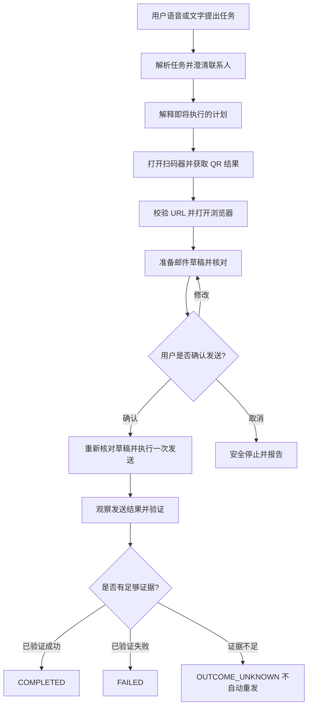
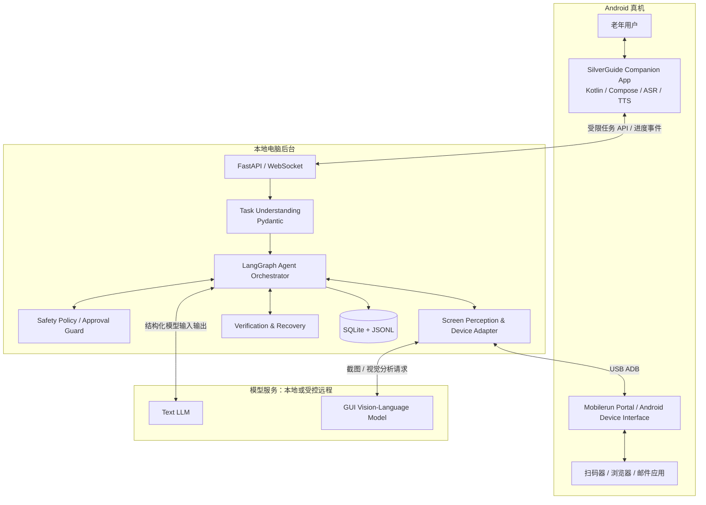
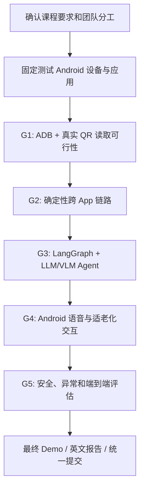

# SilverGuide：Project 1 Proposal 九个 Step 完整回顾与项目设计文档

> **英文项目名称：** SilverGuide — An Explainable Mobile GUI Agent for Older Adults  
> **中文定位：** 面向老年人的可解释智能手机任务助手  
> **课程：** Comprehensive Design of Computer Science and Software Engineering  
> **课程选题：** Project 1 — Mobile GUI Task Agent  
> **文档日期：** 2026-10-08  
> **文档版本：** Proposal Baseline v1.0（设计冻结版；非实现验收报告）  
> **团队：** 4 人，姓名及具体岗位分配待填写  
> **官方 Proposal / Final 截止日期：** 老师尚未公布

---

## 阅读说明：什么已经确定，什么仍待验证？

本文件根据此前连续完成的 **Step 1–Step 9** 对话方案，以及课程 PDF《Project Kick-off》（44 页）整理。其目的有三：

1. 作为团队讨论和分工的**统一需求基线**，避免后续开发时重新讨论已经确定的方向。
2. 作为英文 Proposal PPT、讲稿及 Q&A 的**内容来源**。
3. 作为日后实际开发、测试、技术选型验证与项目交接的**检查清单**。

**严格区分以下三类信息：**

- **[课程要求]**：明确出自《Project Kick-off》PDF，下面均标注页码。
- **[项目决策 / 规划]**：团队目前选择的产品定位和推荐实施方案；不等于课程强制要求。
- **[待验证]**：尚未通过真机实验、真实用户研究或正式项目验收的部分；不得在 Proposal 中写成已实现成果。

### 九步状态总览

| Step | 主题 | 当前阶段结论 | 状态 |
|---|---|---|---|
| 1 | Problem Background & Target Users | 明确目标用户为需要复杂手机任务辅助的老年人，独立完成优先 | 产品定位已固定 |
| 2 | Related Work & Research Gap | 差异在适老化可解释协作与结果验证，不是首次实现 GUI 自动化 | 研究定位已形成，效果尚待验证 |
| 3 | Core Scope & User Stories | 3 个用户故事：获取信息、分享信息、处理异常 | MVP 范围已拟定 |
| 4 | Main Workflow | 扫码 → 网页 → 邮件草稿 → 确认 → 发送 → 验证 | 主线流程已拟定 |
| 5 | Technology Stack & AI Role | Android + PC 后台；LLM/VLM 与确定性执行、安全校验分离 | 部署方向已固定，具体底座待实测 |
| 6 | System Architecture | 双通信通道、七个模块、状态机、工具白名单及证据链 | 逻辑架构已设计 |
| 7 | Risks, Testing & Evaluation | 四层测试、风险门禁、真实结果验证、可选老年用户实验 | 测试计划已拟定，尚无结果 |
| 8 | Team Plan & Timeline | 4 人分工、单仓库、分阶段门禁、相对时间规划 | 团队人数已定，姓名与截止日待定 |
| 9 | English Proposal Slides & Q&A | 一页英文 Proposal 初版、英文讲稿和 14 个 Q&A | 交付初稿已制作，待团队审核 |

### 现在最重要的已固定决策

- **目标用户**：能够使用基础手机功能，但在陌生、复杂、跨 App 任务中经常需要帮助的老年人；**不把所有老年人描述成不擅长手机的群体**。
- **核心产品目的**：帮助用户**独立完成原本不会操作的手机任务**，不以教授每一步手机操作为主要目标。
- **解释方式**：AI 在关键步骤简洁说明“正在做什么、为什么需要确认、是否完成”，而不是长篇教学。
- **主演示**：扫描实体二维码，读取 URL，打开浏览器，准备邮件，经用户确认后发送，并根据可观察状态验证结果。
- **部署选择**：选择此前明确确认的 **A 方案：Android 真机 + 通过 USB ADB 连接的本地电脑／后台**；第一版**不是无需电脑即可独立运行的 Android 产品**。
- **安全原则**：AI 可以建议动作，但发送权限与结果判定由独立的确定性策略控制；不允许自动盲目重复发送。
- **技术首选**：Android Kotlin/Jetpack Compose、Python FastAPI/WebSocket、LangGraph/Pydantic、Mobilerun Portal + ADB、LLM/VLM、SQLite/JSONL、pytest。
- **底座状态**：Mobilerun/ADB 是首选方案，**尚未完成真实设备兼容性验收**；Open-AutoGLM 保留为对照或备选。
- **团队安排**：实际为 **4 人**；正式截止日期未知；开发时间只能先采用内部相对计划。

---

# 第一部分：课程 PDF 的明确要求（九步设计的依据）

## A. Proposal 阶段必须说明什么？

| 课件页码 | 原文核心要求 | SilverGuide 如何回应 |
|---|---|---|
| p.4 | What we plan to build / Why it matters / How we will build and test it | 描述项目价值、架构、开发方案与验证计划 |
| p.5 | Problem: background, target users, a specific user need | Step 1 |
| p.5 | Related work: existing approaches and the gap | Step 2 |
| p.5 | Core scope: **2–3 user stories and one complete main workflow** | Step 3–4 |
| p.6 | Technology stack, data sources, role of AI | Step 5 |
| p.6 | Main risks, mitigation, planned verification | Step 7 |
| p.6 | Member roles and plan of work | Step 8 |
| p.6 | Clear architecture or workflow diagram | Step 4、6、9 |
| p.7 | English presentation and Q&A, submit PDF | Step 9 |
| p.7 | A finished system is **not required** at proposal stage | 当前不将设计稿说成已实现 |

课件 p.7 的原文是 **“One proposal slide per team”**，字面上是每队一页 Proposal；但同页又使用 “slides” 复数。我们因此先制作**一页英文 PDF**，仍需要老师确认页数、讲解时长与提交平台。

## B. Project 1 的专项要求

课件 **p.23–26** 要求：

1. 理解用户请求，提取目标、应用、联系人和内容；缺少信息时澄清。
2. 从截图、OCR、视觉模型或 UI Tree 理解当前屏幕与控件。
3. 执行打开应用、点击、滑动、输入、返回等手机操作。
4. 完成扫码器 → 浏览器 → 邮件应用的跨应用数据传递与任务状态管理。
5. 检查是否成功，处理延迟、弹窗、目标缺失与重试。
6. 展示进度，并提供暂停、取消、必要确认和人工接管。
7. 选择一个手机平台（例如 Android）、少量任务，并保留动作轨迹与结果。
8. **完成课程给出的扫码二维码示例**，且在 Demo 中展示弹窗或失败动作的恢复。

**注意两个范围细节：**

- 课件 p.26 在 Baseline Scope 中写了“**Use 2 apps**”，但指定的“扫码 → 浏览器 → 邮件”可能涉及三个应用。**尚需确认内置扫码器的计数方式**；我们优先遵循老师明确描述的端到端例子，并尽量限制应用数量。
- 课件将 **Voice input** 放在 Optional Extensions 中。**语音不是老师强制要求**，但我们因为选择老年用户和语音交互，已将它列为 **SilverGuide 自定义 MVP 核心能力**。

## C. Final 阶段需要准备哪些工程证据？

虽然目前在准备 Proposal，但未来开发应倒推 Final 要求：

- **p.8**：有实际可运行的界面、后端和连接的数据；真实端到端流程；至少 **2 分钟**的现场或录制演示；展示异常输入或失败处理。
- **p.9**：系统架构与关键决策、可重复测试、AI 行为或辅助流程评估、AI 使用记录和人工审核；证据可被第三方检查。
- **p.10–11**：英文技术报告、代码仓库、README/运行步骤、PDF 幻灯片、系统 Demo，统一团队提交。
- **p.14**：每队 **3–4 人**，一套代码库、统一交付，记录每人的实现、设计、测试及审核贡献，所有人都要能解释整个系统。
- **p.40**：无论选题如何，都应展示真实工作流、用户控制、正常/异常案例和验证。

**PDF 未明确规定**：Proposal 具体讲解时长、Final 项目内部细项评分、多少个测试场景、老年用户实验样本量，以及本组 Proposal / Final 的实际截止日期。

---

# 第二部分：Step 1 — Problem Background & Target Users

## 1.1 目标用户的最终选择

此前讨论曾考虑“精细触控能力受限用户”，但**后来已经明确改为老年人**。应以后者为正式定位，不再以运动障碍患者作为主目标群体。

**Target Users：**

> Older adults who can use basic smartphone functions but need assistance with unfamiliar, complex, or multi-application tasks.

中文解释：会接听电话、使用基础应用，但面对不熟悉的多步骤手机任务时需要帮助的老年人。

### 代表性 Persona（假设，用于设计）

- **人物**：王阿姨，70 岁（虚构 Persona；非实际访谈受试者）。
- **已具备能力**：会用智能手机做一些日常操作。
- **任务困难**：陌生页面、扫码之后的跳转、复制分享网址、切换 App、处理弹窗或报错。
- **实际目标**：尽量不求助家人，也能完成日常数字任务。
- **期待的体验**：用简单语言说出目标；AI 替她操作；关键进度能听懂；重要动作可确认、暂停或取消。

## 1.2 核心问题（Problem Statement）

复杂手机任务会要求用户在不同 App 之间切换、识别陌生控件、输入信息和处理突发界面变化。对于部分只熟悉基础功能的老年人，这些步骤可能阻碍他们**独立完成实际任务**。

我们不以“所有老年人不会使用智能手机”作为前提，也不将产品定位为训练老年人使用手机的教程。

## 1.3 产品目标与交互哲学

**Primary Goal — Independent Task Completion**

> 老年人提出“想完成什么”，SilverGuide 负责在手机上执行并验证，使用户不必依赖家人逐项代操作。

**Interaction Mode — Explain While Acting**

- 由 AI 操作，而不是教用户逐个点击。
- 在关键节点简短报告任务进度，并说明需要确认的原因。
- 重要外部动作（例如发送邮件）必须经过用户确认。
- 遇到异常优先安全恢复，不能恢复则明确停止并解释问题。
- **独立完成**的含义是“不需要第三方替用户完成任务”；用户自己进行确认、对准二维码、暂停/取消均属于正常使用。

## 1.4 可用于英文 Proposal 的表述

> **Problem:** Unfamiliar multi-step smartphone tasks can be difficult for some older adults, especially when tasks involve multiple apps and unexpected interface changes.  
> **Target Users:** Older adults who can perform basic smartphone operations but need help with more complex digital tasks.  
> **Goal:** Help users complete practical smartphone tasks independently through natural-language requests, explainable automation, and user-controlled execution.

**Step 1 结论：** 用户群体与产品目的已固定；具体用户痛点的普遍性与程度，仍应由 Related Work 和未来真实用户研究支持。

---

# 第三部分：Step 2 — Related Work & Research Gap

## 2.1 调研路线与结论

我们从四类已有方案进行比较：

| 类别 | 代表工作 / 产品 | 已解决或部分解决的问题 | 与 SilverGuide 的关系 |
|---|---|---|---|
| Android 无障碍工具 | Google TalkBack、Voice Access | 读屏、语音触发控件与基本设备操作 | 提供无障碍与语音控制基线 |
| 商用智能手机 AI 助手 | Google Gemini 的部分多步手机能力、华为小艺、豆包手机助手 | 在一定支持范围内自动完成手机任务、提供进度与部分人工介入 | 说明手机自动化和用户接管本身不新颖 |
| 学术 Mobile GUI Agent | AppAgent、Mobile-Agent 系列、UI-TARS | 视觉理解、动作决策、规划与失败恢复 | 提供 GUI Agent 方法、模型与评测参考 |
| 面向老年人的手机辅助研究 | 《面向老年人的智能手机虚拟交互助手》等 | 交互指导、教程与适老化帮助 | 说明“老年人手机指导”并非无人研究的空白 |

相关开源参考：

- Open-AutoGLM：<https://github.com/zai-org/Open-AutoGLM>
- AndroidWorld：<https://github.com/google-research/android_world>
- LangGraph：<https://github.com/langchain-ai/langgraph>
- Jetpack Compose：<https://developer.android.com/compose>

> 本节是此前 Step 2 调研的设计结论梳理，不表示对所有竞争产品的所有版本进行了穷尽式功能审计。具体比较应在正式论文和 Final 报告中补齐准确出处、版本与适用范围。

## 2.2 不能声称的“创新”

以下内容**不能**直接宣称为 SilverGuide 独有或全球首创：

- 用语音操控手机。
- 由视觉模型识别屏幕并自动点击。
- 多步骤跨应用手机自动化。
- Agent 失败后重试。
- 显示进度、请求确认或人工接管。
- 向老年人提供手机操作帮助。

单纯把以上功能并列实现，也不自动构成科研意义上的新算法贡献。

## 2.3 我们提出的三个 Research / Design Gaps

### Gap 1：Task Automation → User Understanding

通用 GUI Agent 常重点评估任务完成能力；**老年用户是否理解 Agent 的当前状态与外部操作结果**，应被独立设计和评估。

**拟采用的方法**：基于真实已验证状态生成解释；简短说明阶段性目标；对“已完成”“尚未完成”“状态未知”作明确区分。

### Gap 2：General Automation → Age-Friendly Collaboration

面向老年人的人机交互不应只是把字体变大，关键在于**何时解释、何时让用户决定、发生问题时如何求助**。

**拟采用的方法**：简短中文解释、可见任务进度、必要时的确认入口、大尺寸按钮、用户主动暂停/取消。

### Gap 3：Action Completion → Verifiable, Recoverable Assistance

GUI Agent 能生成动作，不等于外部任务一定完成。

**拟采用的方法**：关键节点状态验证、有限重试、安全停止、避免结果未知时重复发送、可审计的动作轨迹。

**准确定位**：这三个 Gap 是 SilverGuide 希望研究与验证的**用户体验和系统工程整合机会**，不是已被证明“现有产品一概没有”的能力缺口。

## 2.4 建议的研究问题

- **RQ1:** 与相同 GUI Agent 的基础执行模式相比，简洁且状态一致的过程解释，能否提高老年用户对任务进度和结果的理解？
- **RQ2:** 用户控制与故障说明机制，能否帮助老年用户在异常情况中更安全地作出继续、取消或接管的决定？

如果未来没有条件进行真实老年用户实验，只能报告工程测试及可用性设计分析，**不能声称已证实老年人使用体验改善**。

## 2.5 英文 Proposal 可用文案

> Existing accessibility tools support screen reading and voice-based control, while modern mobile GUI agents can automate multi-step tasks. SilverGuide does not claim to invent these technologies. Instead, it investigates how to integrate task automation with age-friendly status explanations, meaningful user confirmation, and verifiable recovery, helping older adults remain informed and in control.

**Step 2 结论：** 差异化方向已形成，不能把设计假设写成既成的实证效果。

---

# 第四部分：Step 3 — Core Scope & User Stories

## 3.1 老师对 User Stories 的真正要求

课程 PDF **p.5 只明确要求“2–3 user stories and one complete main workflow”**。它**没有要求三个互不相关的 App 场景、三条完整端到端工作流或特定英语句式**。

常见 User Story 句式（非课程强制模板）：

> As a [type of user], I want [a goal], so that [a benefit].

User Story 的核心是**用户想完成什么、为什么重要**，而不是“后台用了 OCR/ADB/LLM”。

## 3.2 固定的三个 User Stories

### US-01 — Access Information（独立获取信息）

**英文：**

> As an older adult who is unfamiliar with complex smartphone operations, I want an AI assistant to scan a QR code and open the associated webpage for me, so that I can access useful information independently.

**中文场景：** 扫描社区活动公告上的实体二维码，打开相关网页，不必求助家人逐步操作。

**对应验收：**

- 用户只需要发出需求并对准实体二维码。
- 系统取得**真实二维码数据**，将 URL 传入任务状态，而不是从页面内容猜测。
- 打开与扫描结果对应的网页，并根据实际界面验证。

### US-02 — Share Information（独立分享信息）

**英文：**

> As an older adult who finds switching between applications difficult, I want an AI assistant to send a webpage link to a family member, so that I can share information without manually navigating multiple apps.

**中文场景：** 将扫码获得或正在浏览的网页链接发送给家人。

**对应验收：**

- 获取正确的网页 URL 和明确的收件人地址。
- 准备收件人与正文正确的邮件草稿。
- 用户明确审核批准后才能发送。
- 报告发送结果，并区分“应用接受发送”和“对方已收到”。

### US-03 — Handle Unexpected Situations（遇到错误仍有帮助）

**英文：**

> As an older adult who has difficulty dealing with unexpected pop-ups or failed actions, I want the assistant to explain the problem and help recover from it, so that I can complete tasks without repeatedly asking others for help.

**中文场景：** 扫码权限弹窗、二维码未识别、收件人不明、目标控件找不到、发送结果不明确等。

**对应验收：**

- 系统在关键状态异常时能检测并清楚说明。
- 仅对安全且可重复的动作进行**有限重试**。
- 不能恢复时保留取消、暂停或人工接管的入口。
- 结果未知时不得假报成功，也不得盲目再次发送。

## 3.3 三个故事与一条主流程的关系

| User Story | 主要用户收益 | 在主流程中如何体现 |
|---|---|---|
| US-01 | 取得需要的信息 | 扫码、校验链接、打开网页 |
| US-02 | 与家人共享信息 | 准备邮件、确认并发送 |
| US-03 | 遇到问题仍可安全操作 | 弹窗/错误恢复贯穿整个流程 |

**三个 User Stories 描述三个用户需要，不意味着要搭建三套独立系统。**

## 3.4 MVP 规模与边界

**P0 核心能力（我们的项目自定）：**

- Android 固定测试设备上的真实 GUI 操作。
- 中文语音输入及文字兜底；关键步骤中文语音或文字解释。
- 扫描实体二维码、打开网页、邮件准备与经确认发送。
- Screenshot / UI Tree 驱动的逐步观察与操作。
- 暂停、取消、关键确认、至少一种异常恢复。
- 完整日志、关键状态验证及演示账号数据保护。

**P1 重要增强：** 用户主动要求更详细解释、优化背景播报/通知、改进输入法兼容性、说明长度配置。

**P2 明确不在第一版承诺：** 任意 App 全自动操作、支付/转账、验证码/密码自动处理、医疗预约交易、模型后训练、全部 Android 机型兼容、无人监督长期运行、完全脱离电脑独立运行。

**为什么选择 QR → Email？** 它是课件 Project 1 给出的具体示例，适合把项目范围限制在可演示链路内；**并不表示邮件是所有中国老年人最常用的信息分享方式**。

**Step 3 结论：** US-01 / US-02 / US-03 已形成一套完整、彼此互补的用户故事与 MVP 范围。

---

# 第五部分：Step 4 — Main Workflow 详细设计

## 4.1 典型使用场景

- **用户**：王阿姨，在社区公告栏看到活动二维码。
- **用户指令**：“小银，帮我扫描这个二维码，把里面的网址发邮件给我女儿。”
- **目标结果**：取得真实 QR URL；打开目标网页；向已确认邮箱准备并发送网址；给出基于执行证据的结果反馈。
- **额外说明**：默认二维码印在纸上或显示在另一台设备上；**当前手机屏幕上的二维码识别不是第一版主线**。

## 4.2 七阶段正常工作流

| 阶段 | Agent 负责 | 用户负责 | 状态验证要点 |
|---|---|---|---|
| 1. Understand Request | 识别意图、提取联系人等字段 | 发出语音/文本需求 | 结构化任务合法 |
| 2. Clarify & Explain | 查找预设收件人、澄清歧义、简要介绍计划 | 必要时补充收件人 | 必需参数确定 |
| 3. Scan QR Code | 打开扫码功能并取得结果 | 将摄像头对准二维码 | 获取真实 QR 内容并校验 URL |
| 4. Open Webpage | 打开浏览器、等待页面变化 | 通常无须操作 | 浏览器已打开指定地址 |
| 5. Prepare Email | 切换邮件 App、填写收件人和正文 | 通常无须操作 | 收件人与正文正确 |
| 6. Human Confirmation | 显示确认界面、等待明确授权 | 确认、编辑或取消 | 当前草稿与授权对象一致 |
| 7. Send & Verify | 执行一次发送、检查外部状态、报告结果 | 查看结果 | SUCCESS / FAILURE / UNKNOWN 被如实判定 |



## 4.3 Agent 的执行循环

不是固化坐标脚本，而是每步重复：

**Observe → Decide → Guard → Act → Verify**

- **Observe**：Screenshot + UI Tree + 当前前台 App 等上下文。
- **Decide**：LLM/VLM 根据任务状态提出下一步结构化动作。
- **Guard**：工具白名单、页面约束、关键动作授权检查。
- **Act**：交给设备工具执行经过批准的动作。
- **Verify**：重新观察设备，判断动作是否生效。

如果动作失败，则按错误类型进入 `RECOVERING`、`NEEDS_CLARIFICATION`、`PAUSED` 或安全终止，而非无条件重试。

## 4.4 面向老年人的解释准则

- **说明任务状态，不暴露模型内部思维链**。
- 默认用简短、清晰的中文，在关键节点播报；不逐个朗读每次点击。
- 不以“计划执行”冒充“已执行成功”。
- 对于确认信息要清楚展示收件人和待发送内容。

**正确表达示例：**

> “二维码已经识别到，我正在帮您打开网页。”  
> “邮件草稿已经准备好，请检查收件人和内容。”  
> “已经尝试发送，但暂时无法确认结果。我不会再次发送，以免重复。”

## 4.5 必须覆盖的异常分支

| 异常 | 计划处理 |
|---|---|
| 摄像头权限弹窗 | 解释用途，遵循权限规则，请用户决定或进入受控恢复 |
| 扫描超时 | 提示调整二维码位置，有限重试或取消 |
| 不支持或可疑 URL | 阻止直接执行，报告原因；演示使用受控 HTTPS 地址 |
| 未找到联系人 | 进入澄清，不猜测邮箱 |
| 浏览器/邮件 App 页面变化 | 重新观察、重新 Grounding，不用旧坐标盲点 |
| 邮件草稿发生变化 | 原确认失效，重新核对并请求批准 |
| 用户暂停/取消 | 停止派发后续动作；已经发生的外部动作不能保证撤销 |
| 发送后断连 | `OUTCOME_UNKNOWN`；先核查可观察状态，不能自动重发 |

## 4.6 最终演示建议

- **Demo A**：正常扫码、打开网页、邮件确认与发送验证。
- **Demo B**：一次受控的可恢复异常（如扫码权限/弹窗）。
- **Demo C**：用户取消、修改收件人或暂停，证明 Human-in-the-loop 真正有效。

上述均为**计划中的演示**，不是当前完成情况。

**Step 4 结论：** 用户行为、AI 行为、状态验证与异常分支已经明确定义。

---

# 第六部分：Step 5 — Technology Stack & AI Role

## 5.1 最终部署选择：A 方案

**正式选择：Android 真机 + 电脑/服务器后台。**

实际第一版为：

1. **Android 手机**：安装 SilverGuide Companion App；提供语音、文字、进度、确认、暂停和取消；同时运行扫码、浏览器、邮件应用。
2. **本地电脑**：运行 Agent 后端与设备控制器；手机通过 **USB ADB** 连接；后端处理状态、模型调度、工具调用和日志。
3. **模型服务**：LLM / GUI VLM 可使用受控 API 或部署在计算机/服务器上，具体模型与资源配置待实测。

**重要限定：** 这是受控课堂原型；不应宣传成脱离电脑的独立 Android 助手，也不应默认允许任意远程控制真实用户手机。

## 5.2 技术栈决定表

| 层级 | 首选技术 | 地位 | 理由 |
|---|---|---|---|
| Android UI | Kotlin + Jetpack Compose | 已固定 | 原生 UI、任务进度和适老化控件 |
| 语音输入 | Android SpeechRecognizer | 首选；需真机测中文 | 初版无需自建 ASR |
| 语音播报 | Android TextToSpeech | 首选；需测后台可用性 | 关键状态语音反馈 |
| App 后端通信 | FastAPI + WebSocket | 已固定 | 任务创建、实时进度与控制事件 |
| Agent 状态编排 | LangGraph + Pydantic | 已固定 | 可控状态机、人工确认、结构化数据 |
| Intent LLM | 可替换的文本模型接口 | 具体模型未定 | 解析需求、澄清和生成候选步骤 |
| GUI VLM | 可替换的视觉模型接口 | 具体模型未定 | 辅助理解复杂截图与控件 |
| Device Control | Mobilerun Portal + ADB | **首选，待真机验收** | Screenshot、UI Tree、点击/输入等 |
| 对照/备选 | Open-AutoGLM | 比较路径 | 快速验证已有完整 Agent 的能力 |
| 业务数据 | SQLite | 已固定 | 任务、授权与结果索引 |
| 轨迹日志 | JSONL | 已固定 | 动作、工具调用、错误和证据 |
| 自动化测试 | pytest + Android 真机 E2E | 已固定 | 可重复功能、安全和恢复测试 |
| 可选增强 | FunASR、Langfuse/OTel、MCP | 不属于首版必需 | 仅在证明需要后增加 |

## 5.3 大厂 / GitHub 项目与我们的关系

| 参考项目 | 主要借鉴 | 不应直接照搬的部分 |
|---|---|---|
| Open-AutoGLM | 现成手机 Agent 工作流，便于基线实验 | 不让它与我们自己的自主编排器同时发出冲突操作 |
| Mobilerun / DroidRun 类工具 | Android 设备工具、UI Tree 与 Screenshot | 不能假设所有品牌和 Android 版本天然兼容 |
| Mobile-Agent / GUI-Owl | GUI Agent 的动作规划与评测思路 | 不需为了课程做大规模模型训练 |
| UI-TARS | 视觉 Grounding 与 GUI Action 表示 | 不把开源模型名当作项目创新点 |
| AndroidWorld | 依赖真实环境状态进行成功判定 | 无须第一版实现完整 Benchmark |
| LangGraph | 有状态执行、检查点、人工干预 | 不能将外部副作用放进可能重复执行的位置 |

大厂开源只说明技术参考价值；**不能因此宣称“大厂招聘必然偏好使用某一个框架”**。简历价值应体现架构、可靠性、可运行结果和可复现实验证据。

## 5.4 AI 与确定性模块的职责边界

| 功能 | AI 参与 | 应由确定性软件保障 |
|---|---|---|
| 语音文本识别 | ASR / 系统语音服务 | 用户修改入口、输入完整性检查 |
| 任务理解 | LLM 解析任务和参数 | Pydantic 校验、缺失字段检测 |
| 屏幕理解 | VLM 分析截图 | UI Tree、前台 App、规则验证 |
| 下一步动作 | Agent 提出候选动作 | 白名单、参数与权限校验 |
| GUI 点击/输入 | **不直接执行** | 受限 Device Adapter 执行 |
| 发送批准 | **无权自行批准** | 必须是用户绑定草稿的确认事件 |
| 任务成功判定 | 可以协助提取候选信息 | 以外部状态和证据规则为准 |
| 用户解释 | 可以辅助措辞 | 关键事实基于任务状态模板生成 |

**核心软件工程原则：模型建议 ≠ 授权执行；动作执行 ≠ 任务成功。**

## 5.5 模型和训练策略

- 初版**不训练** LLM/VLM，不引入 RL/Agent 后训练作为课程必做项。
- 先使用可替换的模型接口，测量实际 GUI 任务成功率、时延和费用。
- 若未来需要优化性能，再决定是否自部署、量化或微调。
- 无论本地还是远程模型，均需避免把真实用户密码、通讯录和私人截图直接发送给不受控服务。

**Step 5 结论：** 部署形态和技术栈已固定到架构级；具体模型、Portal 兼容性和扫码链路依然是技术门禁，而非已通过事实。

---

# 第七部分：Step 6 — System Architecture 详细设计

## 6.1 逻辑/物理系统架构



**两条关键通信通道：**

1. **App ↔ FastAPI**：手机上 SilverGuide App 发任务、接收进度、提交确认/取消；USB 课堂原型可以通过 `adb reverse` 映射后端端口。
2. **PC Device Adapter ↔ Android Device Interface**：电脑通过 USB ADB/Mobilerun 读取屏幕并执行 GUI 动作。它与 App 任务通信不是同一通道。

**不能假定**：切换到 Gmail/浏览器后，SilverGuide 的主界面仍能悬浮在所有第三方 App 上。第一版优先使用状态通知、受控任务恢复和必要时返回本 App 的确认界面；系统权限及语音播报生命周期需要真机测试。

## 6.2 七个逻辑模块

| 模块 | 输入 | 输出 | 责任边界 |
|---|---|---|---|
| User Interaction | 用户语音/文字、进度事件 | TaskRequest、UserDecision | 不自行下发 GUI 动作 |
| Task Understanding | 用户指令和上下文 | 结构化目标、缺失字段 | 不直接批准敏感操作 |
| Orchestrator | TaskState、Observation | 下一状态、工具调用计划 | 不忽略安全守卫 |
| Screen Perception | Screenshot、UI Tree | 可操作目标与页面状态 | 不假设 OCR 永远正确 |
| Action Executor | 受限 ActionSpec | ActionResult | 不接受任意 shell 命令 |
| Safety & Verification | 草稿、授权、动作结果、最新观察 | Allow/Block、VerifiedOutcome | 对关键外部动作具有最终决策权 |
| Logging & Evaluation | 全链路事件 | TaskRecord、Trace、证据索引 | 默认脱敏和最小保留 |

## 6.3 核心数据对象（接口草案）

**TaskRequest 示例：**

```json
{
  "task_id": "demo-001",
  "task_type": "scan_and_share",
  "language": "zh-CN",
  "qr_source": "external_camera",
  "share_method": "email",
  "recipient_alias": "女儿",
  "recipient_address": null,
  "requires_confirmation": true
}
```

**ProgressEvent 示例：**

```json
{
  "event_type": "task_progress",
  "task_id": "demo-001",
  "state": "DRAFT_VERIFIED",
  "step": 5,
  "total_steps": 7,
  "message": "邮件草稿已经准备好，请检查收件人和内容。",
  "requires_confirmation": true
}
```

**ActionSpec（概念性 Schema）：** 仅允许 `open_app`、`tap_element`、`swipe`、`enter_text`、`press_back` 等定义好的操作；执行前检查目标应用、动作类型、参数和当前授权。禁止模型直接提交任意 ADB shell 字符串。

## 6.4 建议的任务状态机

| 状态 | 用途 |
|---|---|
| `RECEIVED` | 收到任务 |
| `PARSED` | 参数识别完成 |
| `NEEDS_CLARIFICATION` | 缺少联系人、目标或其他必要信息 |
| `PRECHECKED` | 环境与设备检查通过 |
| `SCANNING` | 执行扫码 |
| `LINK_VERIFIED` | 二维码 URL 已正确获取和校验 |
| `BROWSER_VERIFIED` | 目标网页已打开 |
| `DRAFT_VERIFIED` | 草稿内容与目标匹配 |
| `AWAITING_CONFIRMATION` | 等待用户明确批准 |
| `SEND_COMMITTED` | 记录单次发送意图与许可，避免重复提交 |
| `VERIFYING_SEND` | 获取发送结果证据 |
| `COMPLETED` | 有证据证明完成 |
| `PAUSED` / `RECOVERING` / `CANCELLED` | 暂停、恢复、取消 |
| `FAILED` / `OUTCOME_UNKNOWN` | 已验证失败 / 外部状态尚不确定 |

## 6.5 外部副作用保护：邮件发送

**强约束：**

1. 准备并验证草稿后进入 `AWAITING_CONFIRMATION`。
2. 审核页面显示**实际收件人与具体内容**，批准事件绑定 `task_id + recipient + content fingerprint + approval nonce`。
3. 若草稿发生变化，旧批准自动失效。
4. 真正点击发送之前，重新观察当前 App 和草稿并校验授权。
5. 同一授权只允许发起一次受控发送尝试。
6. 如果已经尝试发送但状态未知，绝不能无条件再点发送；需检查可观察证据，无法确认则报告 `OUTCOME_UNKNOWN`。

**不可夸大：** UI 自动化无法凭空保证邮件的网络级 exactly-once delivery；我们的目标是禁止**结果不明情况下的自动盲目重试**。

## 6.6 QR 扫描路线的主要技术风险

**方案 A1（首选）**：通过手机**已有扫码器**完成操作，并可靠获取它识别出的原始 URL；这最接近课程实例。

**方案 A2（候选）**：如 A1 无法稳定返回可读结果，考虑受控扫码 API，例如 Google Code Scanner；但其 Google Play services 依赖和对课程“built-in scanner”要求的符合程度都需验证/询问老师。

核心验收不是“成功打开扫码界面”，而是**真实 URL 数据能够从 QR 识别阶段正确传给浏览器与邮件阶段**。

## 6.7 拟定 API

| 接口 | 方法 | 目的 |
|---|---|---|
| `/api/tasks` | `POST` | 创建任务 |
| `/api/tasks/{id}` | `GET` | 查询任务当前状态 |
| `/api/tasks/{id}/pause` | `POST` | 请求暂停 |
| `/api/tasks/{id}/resume` | `POST` | 请求恢复；恢复前重新 Observe |
| `/api/tasks/{id}/cancel` | `POST` | 取消后续操作 |
| `/api/tasks/{id}/confirm` | `POST` | 提交对指定草稿的一次性确认 |
| `/ws/tasks/{id}` | WebSocket | 实时任务状态、解释和异常事件 |

以上是**团队自定义业务 API 设计**，不是框架自带的成品接口。

## 6.8 建议仓库结构

```text
silverguide/
├── android-app/
│   ├── ui/
│   ├── voice/
│   ├── notifications/
│   └── networking/
├── backend/
│   ├── api/
│   ├── agent/              # LangGraph / state / planner
│   ├── perception/         # Screenshot / UI Tree / VLM
│   ├── device/             # Mobilerun/ADB adapter
│   ├── safety/             # Approval, policy, restrictions
│   ├── verification/       # Evidence and outcome rules
│   ├── explanation/        # State-grounded messages
│   └── storage/            # SQLite + JSONL
├── tests/
│   ├── unit/
│   ├── integration/
│   └── e2e/
├── experiments/
│   ├── task_cases/
│   └── evaluation/
├── docs/
│   ├── architecture.md
│   ├── api_contract.md
│   └── design_decisions.md
└── README.md
```

**Step 6 结论：** 部署边界、调用关系、核心状态、安全策略和接口草案明确；项目尚未开始工程验收。

---

# 第八部分：Step 7 — Risks, Testing & Evaluation

## 7.1 三层项目质量目标

1. **Functional Correctness**：手机上能否真正完成用户目标？
2. **Reliability & Safety**：遇到弹窗、误操作或结果不确定时，能否安全恢复/停止？
3. **User-Centered Value**：老年用户是否无需家人代操作，能理解正在发生什么，并掌握必要控制权？

我们将结果统一分为：

| Outcome | 意义 | 是否计入任务成功率分子？ |
|---|---|---|
| `SUCCESS` | 目标结果已由外部可观察证据验证 | 是 |
| `SAFE_STOP` | 合理阻止危险或不明确动作，未完成目标 | 否 |
| `FAILURE` | 任务错误/失败或违反安全规则 | 否 |
| `UNKNOWN` | 有外部尝试但证据不足，不假报成功 | 否 |

**邮件点击成功 ≠ 任务成功；应用内“发送成功” ≠ 收件人已接收/阅读。**

## 7.2 四层测试体系

| Level | 类型 | 测试内容 | 工具/环境 |
|---|---|---|---|
| L1 | Unit | 任务解析、URL 校验、状态机、批准失效、禁止重复发送、解释一致性 | pytest、Mock |
| L2 | Integration | FastAPI / LangGraph / Mock Device / Android App 的数据流和异常交互 | pytest、接口模拟、Android UI Test |
| L3 | Real-Device E2E | 真机扫码、浏览器、邮件、弹窗、取消、断连 | 固定 Android 真机、测试账号 |
| L4 | Older-Adult User Study | 独立完成率、理解、控制与可用性 | 自愿受试者；条件允许时 |

建议真机 **12 类固定测试场景 × 每类 3 次 = 36 次执行**。这是**团队自行提出的目标数量，不是课程要求或已执行结果**。

## 7.3 12 类建议 E2E 场景

| ID | 类型 | 例子 | 预期结果 |
|---|---|---|---|
| N01 | 正常 | 预设 QR、预设收件人 | 成功并验证 |
| N02 | 正常 | 另一受控 QR 地址 | 正确 URL 与邮件正文 |
| N03 | 正常 | 已打开网页的分享入口 | 正确获取当前 URL 并发送 |
| N04 | 正常 | 同名 alias 有明确测试映射 | 收件人解析和草稿正确 |
| R01 | 可恢复 | 摄像头权限弹窗 | 用户授权后继续，或合理停止 |
| R02 | 可恢复 | QR 短时间无法识别 | 说明并有限重试 |
| R03 | 可恢复 | 浏览器加载延迟 | 等待并重新观察 |
| R04 | 可恢复 | 控件发生变化 / 弹窗遮挡 | 重观察并处理，不能盲点旧坐标 |
| S01 | 安全 | 收件人缺失或有歧义 | 澄清，禁止猜测 |
| S02 | 安全 | 用户明确取消邮件 | 不发送，报告取消 |
| S03 | 安全 | 批准后草稿发生变化 | 拒绝发送，请重新确认 |
| S04 | 安全 | 点击发送后设备断连/结果未知 | 不自动重发，输出 UNKNOWN |

测试用例需要固定环境重置规则：手机状态、应用版本、二维码内容、联系人/收件地址、网络前置条件与日志保留策略。

## 7.4 关键测量指标

### Verified Task Success Rate (VTSR)

```text
VTSR = VerifiedSuccessfulTasks / AllValidStartedTasks
```

UNKNOWN 与 SAFE_STOP 不进入成功分子；失败数和停止数要单独报告。

### Recovery Rate

```text
RecoveryRate = RecoveredAndCompletedCases / RecoverableFailureCases
```

只在**预先定义为可恢复**的异常上统计；不能把安全停止伪装成完成。

### Safe Handling Rate

```text
SafeHandlingRate = CorrectlyRecoveredOrSafelyStoppedCases / ApplicableAbnormalCases
```

### Explanation Consistency (EC)

```text
EC = EvidenceSupportedFactualExplanations / EvaluatedFactualExplanations
```

关键事实（尤其“已发送成功”）必须由真实状态支撑。

### Independent Completion Rate

```text
IndependentCompletionRate = TasksCompletedWithoutThirdPartyAssistance / AllUserStudyTasks
```

**用户的正常语音输入、扫码对准、确认等交互不算第三方帮助**；测试人员替用户操作则不计入独立完成。

### 其他指标

- Task Duration：从任务启动到最终结果的时间。
- Action Success Rate：单步动作后观察到预期状态的比例。
- Tool / Model Calls：调用次数和时延。
- Intervention Success：用户能否正确暂停/取消/确认。
- Usability Feedback：清晰度、控制感、主观负担、使用信心。

## 7.5 和普通 GUI Agent 的比较设计（拟议）

| 版本 | 底层 Agent | 安全确认 | 过程解释 / 适老化反馈 |
|---|---|---|---|
| B0：Basic Mobile Agent | 与 B1 相同 | 保留 | 仅必要状态，无完整解释体验 |
| B1：SilverGuide | 与 B0 相同 | 保留 | 简洁解释、语音播报、清晰进度反馈 |

比较时不应同时更换 GUI 模型，否则用户体验收益与模型能力差异难以区分。

如果条件允许，建议招募 **5–8 位**具有基本手机使用经验的老年志愿者，采用相近难度任务与交叉顺序做小规模可用性研究，并征得自愿同意。**没有真实受试者时不宣传“已证明提高老年用户独立性”。**

## 7.6 关键风险登记表

| 风险 | 严重性 | 缓解方式 | 测试/门禁 |
|---|---|---|---|
| Mobilerun 兼容性失败 | 高 | 固定目标手机、独立测试基本动作，保留替代 Adapter | Device Smoke |
| 内置扫码器无法返回 URL | 高 | 先验 A1，必要时评估扫码 API 且获课程认可 | QR Ground Truth |
| GUI 控件变化 | 高 | Screenshot + UI Tree + 逐步 Verify | Popup / UI Change |
| 收件人错误、邮件误发 | 极高 | 草稿校验、有效授权、动作白名单 | Unauthorized Send Test |
| 重复发送 / 状态未知 | 极高 | 单次发送门禁、UNKNOWN 不自动重试 | Disconnect Injection |
| 不可信网页诱导 Agent | 高 | URL/工具白名单，不把网页文案作为上层指令 | Prompt Injection Test |
| 中文语音识别错误 | 中 | 任务复述、关键信息澄清、文字输入 | ASR Variation |
| 跨 App 时暂停入口丢失 | 高 | 通知控制、动作前检查暂停标记 | Background Control Test |
| TTS 过度播报或错误播报 | 中 | 状态驱动简短模板、评估解释负担 | Explanation Audit |
| 模型服务超时或断连 | 中 | 状态持久化、超时和安全停止 | Timeout Test |
| 日志泄露私人信息 | 高 | 测试账号、脱敏、最小保留、访问控制 | Privacy Review |

## 7.7 建议的安全验收门禁

- **S1 Authorized Send**：发送必须绑定当前草稿的明确用户确认。
- **S2 Cancellation**：取消生效后不再派发后续新动作；不能承诺撤销已完成的外部操作。
- **S3 No Blind Resend**：发送结果未知时不自动重新发送。
- **S4 Verified Reporting**：缺少证据时不能宣称成功。
- **S5 Tool Restriction**：模型不能通过任意 shell 命令绕过授权。

### 团队自行设定的初步目标（不是成绩、也非老师强制）

| 指标 | 暂定目标 |
|---|---|
| 正常场景经验证成功率 | ≥80% |
| 预设关键安全负面测试通过率 | 100% |
| 预设可恢复异常的恢复成功率 | ≥75% |
| 关键成功声明有证据支持 | 100% |

这些只是前期目标；一旦开始正式测试，应在测试前固定计数方式与场景，**保留所有失败与 UNKNOWN 记录**，不得为达标而事后挑选样本。

**Step 7 结论：** 已制定测试矩阵、风险与指标；不存在当前已取得的准确率、老年用户实测收益或安全门禁通过结论。

---

# 第九部分：Step 8 — Team Plan & Timeline

## 8.1 四人团队与任务划分

团队人数**已确认是 4 人**。四人的真实姓名和岗位尚未在本次对话中对应，因此用 A–D 表示。

| 角色 | 主责模块 | 主要技术 | 最核心交付 |
|---|---|---|---|
| **A — Agent & Backend Lead** | 任务理解、API、编排与状态管理 | Python、FastAPI、LangGraph、Pydantic | Agent Graph、后端 API、状态机 |
| **B — Android & UX Engineer** | Android App、语音、适老化交互、用户控制 | Kotlin、Compose、SpeechRecognizer、TTS | Android UI、通知/确认、语音体验 |
| **C — GUI Automation Engineer** | 真机环境、截图/UI Tree、设备 Adapter 与跨 App 链路 | ADB、Mobilerun、VLM | Device Adapter、扫码/浏览器/邮件执行 |
| **D — Reliability & Evaluation Engineer** | 安全策略、日志、测试体系、指标计算 | pytest、SQLite、JSONL、CI | Approval Guard、验证、E2E 评估报告 |

**共同职责**：接口评审、代码 Review、集成演示、资料整合、最终英文报告和答辩。D 不是“只写报告”，B 也不是“只做静态页面”。

## 8.2 团队协作规则

- 一个 GitHub Monorepo，所有功能以 Issue → Branch → Pull Request → Review → CI → Merge 的方式集成。
- **单台测试手机加互斥执行锁**：任何时候只允许一个任务/Agent 会话控制该设备。
- 提前固定 `TaskRequest`、`TaskState`、`DeviceObservation`、`ActionResult`、`ProgressEvent`、`ApprovalRecord` 等接口。
- 每周至少一次集成展示；建议周初 20–30 分钟任务规划、周末 30–45 分钟集成 Review。
- 按 PR、Commit、测试和设计文档真实记录个人贡献；全体成员能解释完整系统。

## 8.3 内部开发里程碑与顺序

| 阶段 | 建议安排 | 开发重点 | 退出门禁 |
|---|---|---|---|
| P0 Proposal & Design | W6–W7 | 英文 Proposal、接口、架构 | 提交开题材料，接口设计通过团队审核 |
| P1 Device Feasibility | W8 | USB ADB、Mobilerun、扫码数据获取 | **G1** 真机与 QR 链路可行 |
| P2 Core Workflow | W9–W10 | 确定性扫码→浏览器→草稿流程 | **G2** 基础 E2E 跑通 |
| P3 Agent Orchestration | W11–W12 | LLM/VLM、LangGraph、确认与状态验证 | **G3** Agent 能在受控范围运行 |
| P4 User Experience | W13–W14 | 语音、进度、跨 App 控制 | **G4** 可操作的适老化 MVP |
| P5 Testing & Evaluation | W15–W16 | 正常/异常测试、日志、安全与评估 | **G5** 可重复工程证据 |
| P6 Final Delivery | W17–W18 | 英文报告、Demo、代码整理；条件允许时用户实验 | 最终统一提交包 |

**这些 W6–W18 周次是此前我们给出的内部示例时间表，不是课程公布的硬性日期。** 老师**尚未给出 Proposal/Final 的正式截止时间**，公布后必须重新倒排；不应在英文 PPT 中把示例日期说成官方期限。

## 8.4 为什么先做确定性 E2E，再增加 Agent？

- 先证明摄像头扫码、URL 读取、浏览器导航与邮件草稿真正可连通。
- 再将固定动作替换成基于观察的受控 Agent 决策。
- 最后接入语音、进度与安全恢复；否则很难定位失败来自手机接口、模型、状态机还是 UI。

**项目应优先保证课程主流程完成，不应在底层尚不稳定时投入大量时间训练模型或尝试所有 Android 品牌。**

## 8.5 个人贡献记录模板

| Member | Implementation | Design | Testing | Review / Documentation | Evidence |
|---|---|---|---|---|---|
| A | 待填写 | 待填写 | 待填写 | 待填写 | Issue/PR 链接 |
| B | 待填写 | 待填写 | 待填写 | 待填写 | Issue/PR 链接 |
| C | 待填写 | 待填写 | 待填写 | 待填写 | Issue/PR 链接 |
| D | 待填写 | 待填写 | 待填写 | 待填写 | Issue/PR 链接 |

**Step 8 结论：** 四人制与职责骨架明确；真实负责人、排期和官方截止时间仍待补充。

---

# 第十部分：Step 9 — English Proposal Slides & Q&A

## 9.1 已决定的汇报策略

- 按课件 p.7 字面要求先准备**一页英文 Proposal PDF**，不是假定必须做十几页 PPT。
- 一页内容要包含：Problem/Users、Related Work/Gap、2–3 User Stories、Main Workflow、Architecture/AI Role、Risks/Testing、Team Plan。
- 汇报时按照“**用户痛点 → 我们与现有技术的差异 → 真正要完成的手机任务 → 系统怎样实现 → 怎么验证 → 团队如何完成**”的叙述顺序。
- 老师尚未公布汇报时长；此前准备了一份**约 2.5–3 分钟的建议英文讲稿**，需要根据实际时间调整。
- 讲稿不得使用“we have achieved”描述尚未开发的内容；应使用 “we plan to / we propose / we will evaluate”。

## 9.2 已生成的 Step 9 初版资产

在本对话前序步骤中已生成：

| 文件名 | 用途 |
|---|---|
| `SilverGuide_Proposal_One_Slide.pdf` | 英文单页 Proposal 提交候选 |
| `SilverGuide_Proposal_One_Slide.pptx` | 可编辑幻灯片源文件 |
| `SilverGuide_Proposal_Preview.png` | 页面预览 |
| `SilverGuide_Proposal_Script_and_QA.md` | 英文讲稿、14 个 Q&A 与讲解建议 |

本文件是上述内容与 **Step 1–8 项目设计**的统一详细交接文档；它不能替代最终一页 PPT 的排版审查。

## 9.3 可直接用于英文 Proposal 的核心摘要

### Project Title

**SilverGuide: An Explainable Mobile GUI Agent for Older Adults**

### Problem & Users

> Some older adults can use basic smartphone functions but struggle with unfamiliar, multi-step tasks that involve multiple applications and unexpected interface changes. SilverGuide aims to help them complete these tasks independently instead of relying on family members to operate their phones.

### Research Gap

> Existing accessibility tools and mobile GUI agents already provide voice control and automated device operations. SilverGuide focuses on age-friendly explanations, user-controlled execution, and evidence-based task verification rather than claiming to invent GUI automation.

### Three User Stories

1. **Access information** from a QR code without manually navigating complex interfaces.
2. **Share information** with a family member across applications.
3. **Handle unexpected interruptions** through understandable feedback and safe recovery.

### Main Workflow

> **Natural-Language Request → Scan QR Code → Open Webpage → Prepare Email → User Confirmation → Send → Verify Result**

### Technology & AI Role

> An Android application provides voice interaction and accessible feedback. A Python FastAPI backend and LangGraph coordinate task states and multimodal reasoning. A restricted Android device executor performs GUI actions, while deterministic safety policies control authorization and verification.

### Risks & Evaluation

> We will prioritize device and QR-code feasibility, prevent unintended or repeated sending actions, and evaluate verified task success, recovery, explanation consistency, and user independence where feasible.

### Team & Delivery

> Four team members will cover Agent/backend development, Android user experience, GUI automation, and reliability evaluation. Official course deadlines are pending, so the detailed timeline will be finalized after they are announced.

## 9.4 一份可直接练习的英文讲解稿（建议 2.5–3 分钟）

> Good morning, everyone. Our project is **SilverGuide**, an explainable mobile GUI agent designed for older adults.
>
> Our target users can handle basic smartphone functions, but they may struggle with unfamiliar, multi-step tasks involving different apps. We do not aim to teach every phone operation. Instead, we want to help users complete useful tasks independently, without needing family members to take over their phones.
>
> Related work includes **TalkBack** and **Voice Access**, which improve accessibility and direct phone control, and mobile GUI agents such as **AppAgent** and **Open-AutoGLM**, which automate interface actions. We are not claiming to invent smartphone automation. Our focus is to combine it with concise, age-friendly explanations, meaningful user confirmation, and verifiable recovery from errors.
>
> We propose three user stories: **access information from a QR code, share a webpage with a family member, and handle interruptions safely**.
>
> Our main demonstration is one complete workflow. An older adult asks SilverGuide to scan a community notice QR code and email the link to her daughter. The assistant clarifies missing details, observes the phone screen, opens the link, prepares the email, requests approval, and then executes and verifies the sending action. When a pop-up or other problem appears, it should explain the situation, recover safely where possible, or stop and ask for help.
>
> Technically, an **Android application** built with Kotlin and Jetpack Compose provides voice interaction, progress updates, and controls. A **Python FastAPI backend** runs a **LangGraph** task workflow on a computer connected to the phone through USB ADB. An LLM interprets user requests, a vision-language model helps understand screenshots, and **Mobilerun/ADB** provides restricted GUI actions. Deterministic safety rules enforce confirmation, while **SQLite and JSONL** store minimal execution evidence.
>
> Our implementation plan starts with device and QR-code feasibility, continues with the complete cross-app workflow and accessible interface, and ends with reproducible functional, safety, and, if feasible, older-adult usability tests. Our four members will be responsible for the backend, Android experience, GUI automation, and reliability evaluation. The official course deadlines have not yet been announced.
>
> Thank you. We welcome your questions.

## 9.5 十四个预备 Q&A（浓缩版）

| # | Teacher's Question | 回答核心 |
|---|---|---|
| 1 | Why older adults? | 聚焦基本功能会用、复杂跨 App 操作困难的特定老年群体，不对所有老年人一概而论。 |
| 2 | Is this a teaching app? | 不是，核心是完成任务，解释服务于进度和安全。 |
| 3 | What is novel? | 不宣称手机自动化首次出现；贡献在可解释协作与结果验证的系统整合、评估。 |
| 4 | Why QR and email rather than WeChat? | 课程有明确示例，受控可复现；不代表邮件是老年人首选渠道。 |
| 5 | Why three user stories for one workflow? | 三个不同用户需要可由一条 E2E 流程共同体现。 |
| 6 | Why AI instead of a fixed ADB script? | 不同屏幕、弹窗和延迟需要观察当前状态再决定动作。 |
| 7 | Which parts use AI? | 理解请求、辅助视觉与动作建议；授权、工具调用和验收由确定性组件承担。 |
| 8 | How to avoid sending the wrong email? | 草稿核对、绑定草稿的明确批准、失效保护、未知结果不重发。 |
| 9 | How to define success? | 用扫码值、网页/草稿状态和外部执行证据判断；UNKNOWN 不算成功。 |
| 10 | Does the App work without a PC? | 初版不行，是 Android + 本地 PC/ADB 的受控原型。 |
| 11 | Biggest risks and backups? | 真机兼容、QR 结果、GUI 变化、邮件安全；先通过门禁、保留 Adapter 备选。 |
| 12 | How to show value for older adults? | 技术 E2E + 安全评估；如可招募受试者，再进行独立完成与理解测试。 |
| 13 | Why two apps but three components? | PDF 表述存在歧义，需问老师如何计算扫码器。 |
| 14 | How do four students coordinate? | 按模块分工、同一仓库、PR/CI、每周集成；官方日期公布后倒排。 |

更完整的逐题英文口语回答可参阅已生成的 `SilverGuide_Proposal_Script_and_QA.md`。

**Step 9 结论：** 英文演示材料已经有初版，但团队成员姓名、最终课程时间、具体一页限制和技术路线可行性还待确认/验证。

---

# 第十一部分：交接用的关键门禁与待办列表

## 11.1 已固定的决策（不要无故回退）

- [x] 课程项目选题为 **Project 1 — Mobile GUI Task Agent**。
- [x] 项目名称 **SilverGuide**，英文副标题 **An Explainable Mobile GUI Agent for Older Adults**。
- [x] 目标用户：复杂手机任务需要帮助的老年人。
- [x] 主要目标：**独立完成任务**，解释不是教学课程。
- [x] 交互方式：用户说出需求，AI 边执行边简洁说明。
- [x] 三个 User Stories：获取信息、分享信息、异常辅助。
- [x] 主流程：**扫码 → 网页 → 邮件草稿 → 明确确认 → 发送与验证**。
- [x] 执行原则：**Observe → Decide → Guard → Act → Verify**。
- [x] 部署 **A 方案：Android 真机 + USB ADB + PC 后台**。
- [x] 核心技术选型与模块边界已拟定。
- [x] 实际团队 **4 人**。
- [x] Proposal 暂按单页英文 PDF 方案准备。

## 11.2 尚未解决的关键问题（高优先级）

- [ ] 老师确认：Proposal **确切页数、讲解时长、提交截止日期与方式**。
- [ ] 老师确认：扫码器 + 浏览器 + 邮件算几个 App，是否满足“Use 2 apps”。
- [ ] 四位成员真实姓名及 A/B/C/D 分工最终对应。
- [ ] 选定 Android 设备型号、系统版本、扫码器、浏览器和邮件 App 版本。
- [ ] USB ADB 设备连通和 Mobilerun Portal 兼容测试。
- [ ] 证明内置扫码流程可以可靠获得**原始二维码 URL**。
- [ ] 测试 GUI 输入中文和 URL、跨应用切换与界面变化处理。
- [ ] 验证任务进度/暂停/取消/确认在第三方 App 前台时能否可靠使用。
- [ ] 选择并基准测试合适的文本 LLM 与 GUI VLM；检查成本、延迟和正确性。
- [ ] 完成邮件发送状态验证与防止盲目重复发送的安全测试。
- [ ] 决定能否招募真实老年参与者进行自愿小规模测试。

## 11.3 项目从现在到正式实施的建议顺序



**若 G1 未通过，不应声称整个系统已经具备实现基础；应首先完成失败原因分析与替代扫码方案验证。**

## 11.4 最终交付清单（课程 Final 倒推）

- [ ] 可运行的 Android + PC 原型。
- [ ] 从用户输入到结果验证的真实端到端任务。
- [ ] 至少一种异常输入/失败恢复案例。
- [ ] 不少于两分钟的现场或录制 Demo（按课件要求）。
- [ ] 代码仓库、README、清晰的安装和运行命令。
- [ ] 架构图、模块职责、重要设计决策。
- [ ] 单元、集成、E2E、安全测试与可复现日志。
- [ ] AI 行为或 AI 辅助工作流的实际评估结果。
- [ ] AI 工具使用记录、人工修改与审核情况。
- [ ] 四人具体贡献记录。
- [ ] 英文 Final Slides PDF、技术报告和团队统一材料包。

---

# 第十二部分：最容易产生误解的五件事

### 1. “已经做完九步”不是“项目已经开发完成”

九步完成的是**Proposal 内容、系统设计与测试规划**。尚未声称 Android App、后端、模型与真实手机执行器已完成集成。

### 2. “Explainable”不是模型内部机理可解释性

本项目的 Explainable 指**面向用户的状态说明、操作目的和验证反馈**，不承诺解释视觉语言模型所有内部推理。

### 3. “用户独立完成”不是“完全无人参与”

用户仍可澄清联系人、对准二维码、确认发送、暂停和取消；独立指**不依赖第三方代替其操作**。

### 4. “使用先进开源项目”不等于“有原创算法贡献”

项目价值是把多模态感知、GUI 工具、状态机、安全权限、用户体验和评估闭环做好，清晰说明借鉴的开源组件与团队自主开发部分。

### 5. “安全地控制手机”不是“所有平台上都能上架”

当前使用的是固定设备 + USB ADB 受控原型。要迁移到无电脑的独立 Android 产品，还需要权限、系统限制、用户数据保护及平台政策专项设计。

---

# 附录 A：会议 / Proposal Review 的建议议程

| 顺序 | 预计时间 | 要审查的核心问题 |
|---|---:|---|
| 1 | 5 分钟 | 四人是否一致理解用户是谁、为什么需要 SilverGuide |
| 2 | 5 分钟 | 三个 User Stories 和二维码邮件演示是否过宽/过窄 |
| 3 | 8 分钟 | Android + PC / ADB / Mobilerun 的风险与备选路线 |
| 4 | 5 分钟 | 用户确认、UNKNOWN 结果和异常恢复是否说得清楚 |
| 5 | 5 分钟 | 角色负责人、具体计划、何时开始 G1 真机试验 |
| 6 | 5 分钟 | 一页英文 PPT 和英文 Q&A 分工 |

**Meeting Outcome 应当记录：** `Decisions`、`Open Questions`、`Owners`、`Due Dates`、`Evidence Links`。

# 附录 B：参考资料与追溯

## 课程官方材料

- 《Project Kick-off》，2026 年 9 月 23 日，44 页。
- **p.4–7** Proposal 内容与提交；**p.8–11** Final 与报告；**p.13–14** 教学日历与团队规范；**p.22–26** Project 1；**p.40** 全项目共性要求；**p.44** 曾经的组队信息提交日期。

## 之前讨论和已生成的产物

- Step 1–Step 9 的 SilverGuide 连续项目讨论与方案。
- `SilverGuide_Proposal_One_Slide.pdf` / `.pptx`。
- `SilverGuide_Proposal_Script_and_QA.md`。

## 实施阶段可进一步核查的公开资料

- [Open-AutoGLM GitHub](https://github.com/zai-org/Open-AutoGLM)
- [AndroidWorld GitHub](https://github.com/google-research/android_world)
- [LangGraph GitHub](https://github.com/langchain-ai/langgraph)
- [Android Jetpack Compose](https://developer.android.com/compose)
- Google Android 开发者文档（ADB、SpeechRecognizer、TextToSpeech、通知、后台执行）。
- Mobile-Agent、UI-TARS、AppAgent 的原论文和官方代码（后续引用时应核对具体版本与支持范围）。

> **最后的冻结结论：** SilverGuide 是一个帮助老年人完成不熟悉手机任务的可解释、可控、多模态 Mobile GUI Agent 课堂项目。九步 Proposal 已形成统一设计基线；下一阶段应先确认课程与团队行政事项，然后开展 Android 真机、扫码结果和跨 App 操作的 **G1/G2 工程可行性验证**。在没有真实测试之前，所有功能、成功率和用户体验收益均只作为预期目标陈述。
